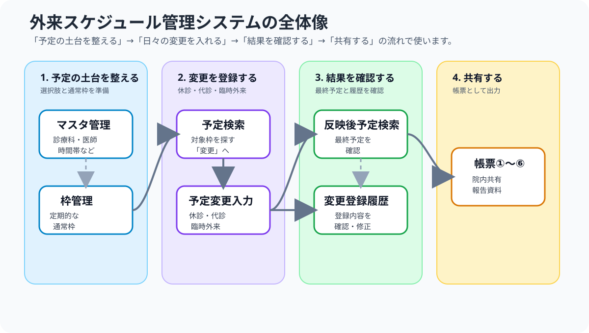

# スタートアップガイド（事務担当者向け）

外来スケジュール管理システムを初めて使う方向けの、初回操作説明用ガイドです。詳しい画面説明や例外対応は `docs/担当者マニュアル.md` を参照してください。

---

## 1. 初回操作説明で扱うこと

初回は、日常業務で使う流れに沿って、次の順番で一緒に操作してみましょう。

1. **予定変更を登録してみましょう**
2. **変更後の予定と変更履歴を確認する**
3. **代表的な帳票を出力する**
4. **予定の土台となる通常枠の修正・新規登録を確認してみましょう**

> ポイント: まず日々発生する変更登録に触れてから、予定の土台となる通常枠の管理方法を確認します。

---

## 2. アプリの全体像

このアプリは、**マスタ** と **通常枠** をもとに予定を作り、日々の変更を反映して、最終予定や帳票を確認する仕組みです。

初回操作説明では、日々の業務で使う **予定変更 → 確認 → 帳票出力** を先に操作し、最後に予定の土台となる **枠管理** を確認します。

---

## 3. 起動する

1. デスクトップの **起動ボタン** ショートカットをダブルクリックします。
2. しばらくすると、専用のブラウザ画面が自動で開きます。
3. 左側メニューが表示されたら起動完了です。

通常は、手動でブラウザを開いたり URL を入力したりする必要はありません。画面が開かない場合は、少し待って再度起動ボタンを押し、それでも開かない場合は担当者または保守担当者に確認してください。

---

## 4. 画面の使い分け

| やりたいこと | 使う画面 |
|---|---|
| 通常の予定を確認する | 予定検索 |
| 休診・代診など通常枠の変更を登録する | 予定検索 → 対象行の「変更」ボタン → 予定変更入力 |
| 臨時外来を登録する | 予定変更入力（臨時外来登録タブ） |
| 変更・臨時外来を含む最終予定を確認する | 反映後予定検索 |
| 登録済みの変更を確認・修正する | 変更登録履歴検索 |
| 帳票を出力する | 帳票①〜⑥ |
| 通常枠を新規追加・修正する | 枠管理 |
| 医師・診療科・時間帯などを管理する | マスタ管理 |

---

## 5. 操作1：予定変更を登録してみましょう

### 通常枠の休診・代診

通常枠の変更は、予定検索で対象枠を選んでから登録します。

1. 「予定検索」を開きます。
2. 変更したい日付・診療科・医師などで対象予定を探します。
3. 対象行の **「変更」** ボタンを押します。
4. 「予定変更入力」に移動したら、対象枠が表示されていることを確認します。
5. 変更種別、変更内容、備考、変更者などを入力します。
6. 代診の場合は代診医を選びます。
7. 「変更登録」を押します。

「予定変更入力」を直接開いて「対象枠が選択されていません」と表示された場合は、「予定検索」に戻って対象行の「変更」ボタンから開き直してください。

### 臨時外来

1. 「予定変更入力」を開きます。
2. 「臨時外来登録」タブを選びます。
3. 日付、時間帯、診療科、担当医、診察室などを入力します。
4. 「臨時外来を登録」を押します。

---

## 6. 操作2：変更後の予定と変更履歴を確認してみましょう

### 変更後の予定を見る

1. 「反映後予定検索」を開きます。
2. 変更した日付、診療科、医師などを指定します。
3. 休診・代診・臨時外来が反映されているか確認します。

### 変更履歴を見る

1. 「変更登録履歴検索」を開きます。
2. 変更した日付や診療科などを指定します。
3. 登録した変更が履歴に表示されるか確認します。

---

## 7. 操作3：代表的な帳票を出力してみましょう

最初は、変更内容を確認しやすい **帳票② 予定変更一覧** を出力します。

1. 「帳票② 予定変更一覧」を開きます。
2. 対象期間を指定します。
3. 表示または出力を実行します。
4. 変更した内容が帳票に出るか確認します。

| 帳票 | 主な用途 |
|---|---|
| 帳票① 外来担当医表 | 担当医体制の共有 |
| 帳票② 予定変更一覧 | 休診・代診・臨時外来の共有 |
| 帳票③ 外来数 | 外来数の集計 |
| 帳票④ 常勤日別コマ数 | 常勤医の稼働確認 |
| 帳票⑤ 常勤・非常勤月別コマ数 | 勤務形態別の月次確認 |
| 帳票⑥ 非常勤医師勤務報告 | 非常勤医師の勤務確認 |

---

## 8. 操作4：通常枠の修正・新規登録を確認してみましょう

「枠管理」は、予定作成の土台となる通常枠を管理する画面です。毎週・毎月など定期的に存在する枠の修正や追加に使います。特定の日だけの休診・代診は「枠管理」ではなく、「予定検索」から変更登録します。

### 既存枠を修正する

1. 「枠管理」を開きます。
2. 診療科、医師、曜日などで対象枠を絞り込みます。
3. 編集対象枠IDを選びます。
4. 曜日、週番号、時間帯、診察室、医師、帳票用診療科名、有効期間などを修正します。
5. 更新します。
6. 必要に応じて「予定検索」で表示を確認します。

### 新規枠を追加する

1. 「枠管理」を開きます。
2. 新規追加エリアで、曜日、週番号、時間帯、診察室、医師、診療科、有効期間などを入力します。
3. 登録します。
4. 「予定検索」で、想定した日付に枠が表示されるか確認します。

### 注意点

- 医師・診療科・時間帯が選べない場合は、先にマスタ管理を確認します。
- 想定した日に表示されない場合は、曜日、週番号、有効期間を確認します。

---

## 9. 終了する

1. サイドバーの **「💾 バックアップして終了」** を押します。
2. 処理が完了するまで待ちます。
3. アプリが終了したことを確認します。

自動終了しない場合は、担当者または保守担当者に確認してください。

---

## 10. 困ったとき

| 困りごと | 最初に見るところ |
|---|---|
| 予定が表示されない | 日付、診療科、医師、曜日、週番号、有効期間 |
| 医師・診療科・時間帯が選べない | マスタ管理 |
| 通常枠の変更登録ができない | 予定検索で対象行の「変更」ボタンから開いているか |
| 登録内容が見つからない | 反映後予定検索、変更登録履歴検索 |
| 帳票に出ない | 対象期間、帳票種類、帳票表示設定 |

---

## 11. 初回操作説明チェックリスト

- [ ] 起動ボタンからアプリを開ける
- [ ] 予定検索の「変更」ボタンから通常枠変更を登録できる
- [ ] 予定変更入力で臨時外来を登録できる
- [ ] 反映後予定検索で変更後の予定を確認できる
- [ ] 変更登録履歴検索で履歴を確認できる
- [ ] 帳票②を出力できる
- [ ] 枠管理で既存枠の修正手順を確認できる
- [ ] 枠管理で新規枠の登録手順を確認できる
- [ ] バックアップして終了できる
